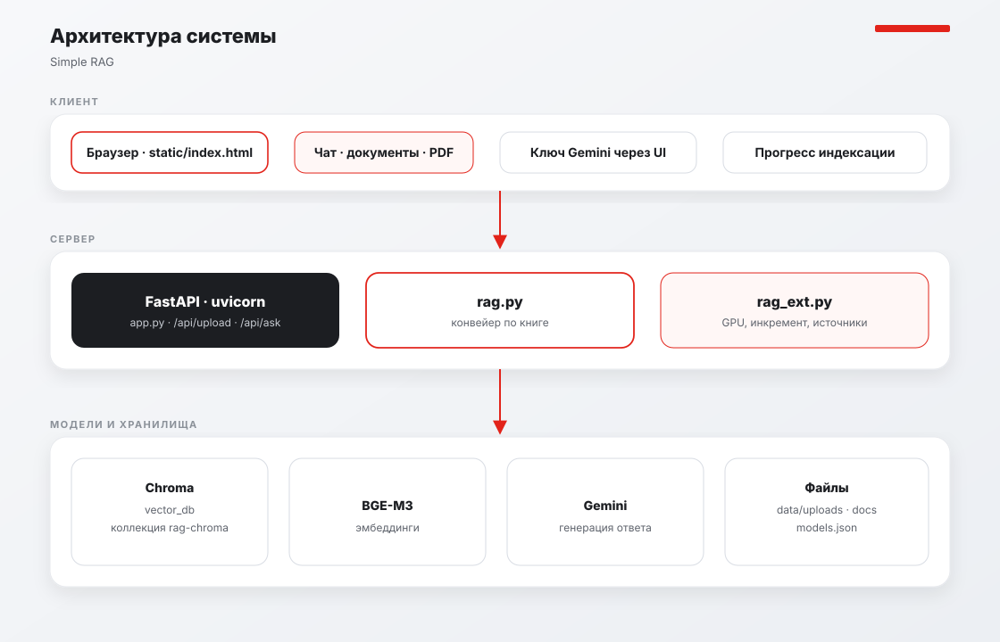
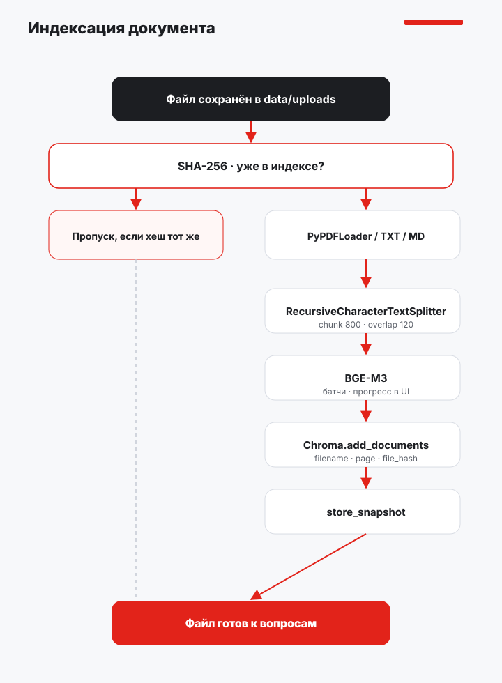
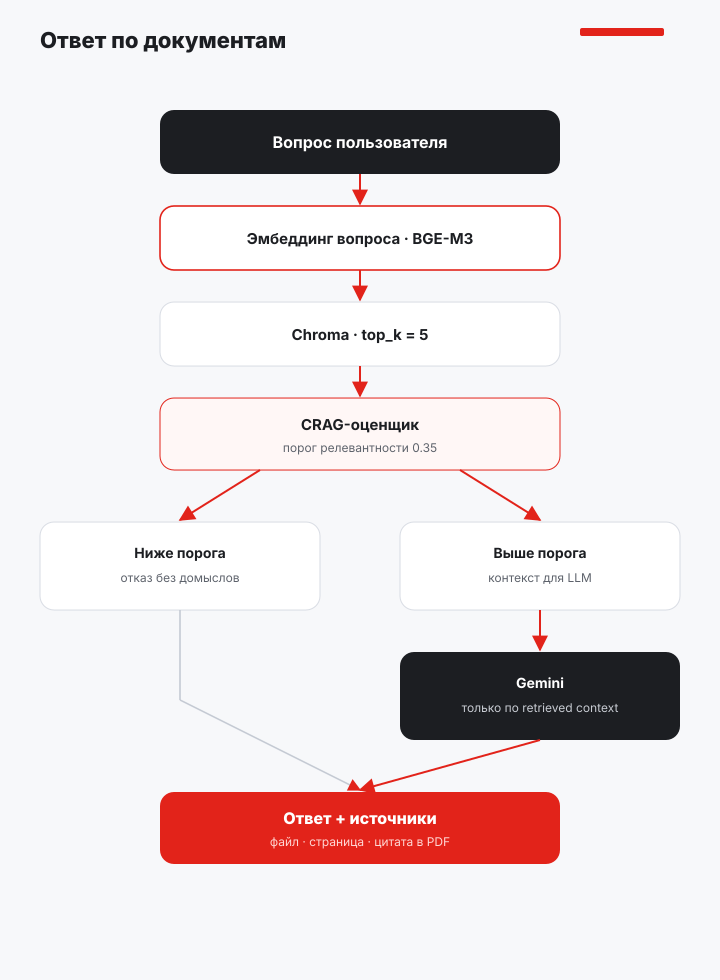
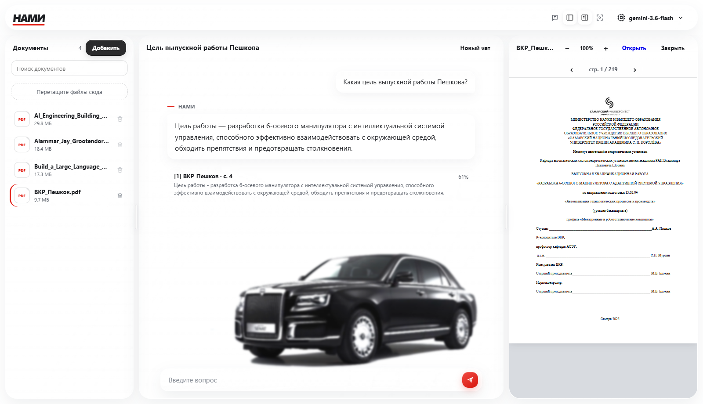

# Simple_RAG — отчет по практике

Локальная RAG-система для вопросов по загруженным PDF, Markdown и TXT. Ответ строится только из найденных фрагментов корпуса. Если релевантного контекста нет, модель не додумывает — возвращается фиксированный отказ.

| | |
|---|---|
| Интерфейс | FastAPI + одностраничный фронтенд |
| Retrieval | Chroma, cosine, `top_k = 5` |
| Эмбеддинги | `BAAI/bge-m3` на GPU (CUDA) |
| Генерация | Gemini, OpenAI или OpenAI-compatible API |
| Книга | Jia Huang, *RAG from First Principles* |

Запуск в Docker:

```powershell
docker compose up
```

Откройте [http://127.0.0.1:8000](http://127.0.0.1:8000). Модель задаётся в меню → **Подключить API**: Google AI Studio, OpenAI, Ollama, LM Studio или другой OpenAI-compatible endpoint.

---

## Архитектура

<p align="center">
  
</p>

### Слои

1. **Клиент** — `static/index.html`: чат, библиотека документов, просмотр PDF с масштабом, источники с переходом на страницу.
2. **Сервер** — `app.py` (FastAPI). Загрузка и индексация идут в отдельном потоке, чтобы UI не зависал.
3. **RAG** — `rag.py` повторяет конвейер из книги Huang; `rag_ext.py` держит доработки проекта.
4. **Хранилища** — Chroma (`vector_db/`), статус документов (`vector_db/documents.json`), файлы (`data/uploads`, `data/docs`), ключи моделей (`data/models.json`).

### Компоненты

| Компонент | Роль | Где |
|---|---|---|
| Браузер | Чат, загрузка, PDF.js, масштаб | `static/index.html` |
| FastAPI / uvicorn | HTTP API | `app.py` |
| PyPDFLoader | Страница PDF → `Document` | `rag.py` |
| RecursiveCharacterTextSplitter | Чанки 800 / overlap 120 | `rag.py` |
| BGE-M3 | Векторы, GPU если есть CUDA | `rag_ext.py` |
| Chroma | Поиск по cosine | `vector_db/` |
| CRAG-порог `0.35` | Отсев нерелевантных чанков | `rag.py` |
| LLM | Генерация только по контексту | Google AI Studio, OpenAI, Ollama, LM Studio, другой API |
| Docker | Образ `simply-rag`, GPU, тома | `Dockerfile`, `docker-compose.yml` |

---

## Индексация

<p align="center">
  
</p>

1. Файл пишется в `data/uploads`. Если это замена, новый байтовый поток идёт во временный `.part`, старый файл не трогается.
2. Считается SHA-256. Пропуск только если хеш совпал **и** у документа статус `ready`.
3. В `vector_db/documents.json` запись получает статус `indexing` / `ready` / `failed`. Хеш сам по себе не означает, что все батчи дописаны.
4. PDF режется по страницам, текст — одним документом.
5. Чанки получают `filename`, `page`, `file_hash`, `generation`.
6. BGE-M3 считает эмбеддинги на GPU батчами; в списке документов виден прогресс.
7. После последнего батча статус становится `ready`, предыдущее поколение чанков удаляется. Обрыв или ошибка — `failed`; уже готовая версия остаётся в индексе.
8. Запись в Chroma идёт через **один** PersistentClient — повторное открытие той же базы на Windows ломает Chroma 1.5.

---

## Ответ

<p align="center">
  
</p>

1. Вопрос кодируется той же моделью BGE-M3.
2. Chroma возвращает `top_k` чанков со score.
3. Оценщик (упрощённый CRAG из книги) оставляет только score ≥ `0.35`.
4. Если ничего не прошло порог — фраза отказа, без вызова LLM.
5. Иначе выбранная LLM отвечает строго по контексту. В карточке — файл, страница, цитата; клик открывает PDF на нужной странице.

---

## Интерфейс

Два снимка живого экрана: чат с ответом по ВКР и просмотр того же PDF.

**Чат.** Вопрос, ответ в стеклянной плашке, карточка источника со страницей и score. Слева — история и библиотека из четырёх PDF.

<p align="center">
  
</p>

**Просмотр документа.** Клик по источнику или файлу открывает PDF.js справа: страница, масштаб 50–400%, переход по страницам.

<p align="center">
  
</p>

---

## Примеры для проверки

Корпус — четыре PDF в `data/uploads` (4468 чанков). Полный прогон: [`docs/examples/qa-from-corpus.md`](docs/examples/qa-from-corpus.md).  
Ответы ниже сняты с живого `POST /api/ask` (BGE-M3, порог 0.35). На 4 из 40 запросов retrieval не прошёл порог — это короткие страницы ISBN/оглавления; система честно отказала, а не додумала.

### Подготовка

1. Запустите сервер, дождитесь индексации четырёх PDF.
2. Меню модели → **Подключить API** → Google AI Studio или OpenAI (ключ), либо Ollama / LM Studio / другой API.
3. Задайте вопросы из таблиц. Посторонний вопрос («Какой счёт в финале ЧМ-2022?») должен дать отказ без карточек источников.

### Сценарии интерфейса

| № | Действие | Ожидание |
|---|---|---|
| 1 | «Какая столица Франции?» или «Кто выиграл чемпионат мира 2022?» | Отказ: *В загруженных документах недостаточно информации для ответа.* Карточек источников нет. |
| 2 | Клик по карточке источника | PDF открывается на указанной странице, масштаб по ширине. |
| 3 | `+` / `−` или Ctrl+колёсико в просмотре | Масштаб 50–400%, процент сбрасывает к ширине панели. |
| 4 | Повторно загрузить тот же файл с тем же содержимым | Документ со статусом `ready` и тем же SHA-256 не дублируется. Другой файл с тем же именем заменит индекс только после полной индексации. |
| 5 | Удалить документ в библиотеке | Файл исчезает с диска, чанки уходят из Chroma. |
| 6 | Меню модели → корзина | Модель удаляется; без ключа `/api/ask` отвечает 503. |

### 1. ВКР_Пешков.pdf


| № | Запрос | Результат системы | Стр. |
|---|---|---|---|
| 1 | Как называется выпускная квалификационная работа Пешкова? | «РАЗРАБОКА 6-ОСЕВОГО МАНИПУЛЯТОРА С АДАПТИВНОЙ СИСТЕМОЙ УПРАВЛЕНИЯ» (орфография как в PDF). | 1 |
| 2 | В каком вузе и в каком году выполнена ВКР? | Самарский национальный исследовательский университет имени академика С. П. Королёва, Самара 2025. | 1 |
| 3 | Кто руководитель ВКР и какая у него степень? | С.П. Мурзин, доктор технических наук (д.т.н.). | 1 |
| 4 | Какая цель работы? | Разработка 6-осевого манипулятора с интеллектуальной системой управления: взаимодействие со средой, обход препятствий, предотвращение столкновений. | 4 |
| 5 | Какая масса объектов, которые должен перемещать манипулятор? | До 8 кг. | 20 |
| 6 | Какие режимы работы устройства описаны? | Ожидание, задание движения, аварийный. | 20–21 |
| 7 | Когда включается аварийный режим? | Если лидары видят объект на траектории или звенья касаются препятствия. | 21 |
| 8 | Какие моменты на осях манипулятора? | Ось 1: 1000 Н·м; 2: 600; 3: 400; 4: 60; 5: 80; 6: 15 Н·м. | 25 |
| 9 | Какая общая потребляемая мощность системы? | 2465 Вт. | 40–41 |
| 10 | Какая общая погрешность позиционирования и в какой среде собрана симуляция? | 0,2 мм; симуляция в gazebo sim / ROS2 Jazzy. | 59–60 |

### 2. AI_Engineering_Building_Applications_with_Foundation_Models_Chip.pdf

Chip Huyen, *AI Engineering: Building Applications with Foundation Models*, O’Reilly.

| № | Запрос | Результат системы | Стр. |
|---|---|---|---|
| 1 | Кто автор книги AI Engineering? | Chip Huyen. | 3–5 |
| 2 | Как полностью называется книга и кто издатель? | *AI Engineering: Building Applications with Foundation Models*, O’Reilly Media, Inc. | 6 |
| 3 | Когда вышло первое издание? | Отказ: страница с датой «December 2024: First Edition» не прошла порог 0.35. | — |
| 4 | Какой ISBN у книги? | Отказ: строка `978-1-098-16630-4` на выходных данных не набралась в top-k выше порога. | — |
| 5 | О чём глава 5 по словам автора? | Prompt engineering: что такое промпт, практики, prompt attacks и защита. | 21 |
| 6 | Какие два паттерна построения контекста разбирает глава 6? | RAG и agentic. | 21 |
| 7 | О чём глава 7? | Finetuning модели под приложение, PEFT / адаптеры, memory footprint. | 21 |
| 8 | Какая модель начала революцию deep learning в 2010-х и на чём её учили? | AlexNet (Krizhevsky et al., 2012), классификация ImageNet: >1 млн изображений, 1000 классов. | 41 |
| 9 | Сколько по оценке автора стоит разметить миллион картинок ImageNet по 5 центов за штуку? | $50,000. | 41 |
| 10 | Почему масштабировать разметку до миллиона категорий дорого? | Стоимость только разметки выросла бы до $50 млн. | 41 |

### 3. Alammar_Jay_Grootendorst_Maarten_Hands_On_Large_Language_Models.pdf

Jay Alammar и Maarten Grootendorst, *Hands-On Large Language Models*.

| № | Запрос | Результат системы | Стр. |
|---|---|---|---|
| 1 | Кто авторы Hands-On Large Language Models? | Jay Alammar и Maarten Grootendorst. | 1 |
| 2 | Какой подзаголовок у книги? | Language Understanding and Generation. | 1 |
| 3 | Кто создатель sentence-transformers и что он пишет о книге? | Nils Reimers: визуальный гайд по generative, representational и retrieval-применениям. | 2 |
| 4 | Что Andrew Ng говорит об этой книге? | Авторы дают иллюстрированные описания сложных тем; книга полезна, чтобы понять, как строят LLM. | 2 |
| 5 | В чём главная философия книги? | Intuition-first: фундамент LLM и визуальный язык, а не гонка за последними тулами. | 12 |
| 6 | Чем representation models отличаются от generative models по книге? | Representation (encoder) не генерируют текст; generative (decoder, GPT) генерируют. | 13 |
| 7 | Какие предварительные знания нужны читателю? | Python и основы ML; PyTorch/TensorFlow и generative modeling не обязательны. | 13 |
| 8 | О чём глава 8? | Отказ: оглавление «Semantic Search and Retrieval-Augmented Generation» не прошло порог. | — |
| 9 | Что обсуждается в главе 7 про LangChain? | Загрузка квантованных моделей, chains, prompt templates, memory (buffer, windowed, summary), agents и ReAct. | 9 |
| 10 | О чём глава 10 про эмбеддинги? | Creating Text Embedding Models: contrastive learning, SBERT, fine-tuning эмбеддингов. | 10 |

### 4. Build_a_Large_Language_Model_From_Scratch_Sebastian_Raschka_1_2024.pdf

Sebastian Raschka, *Build a Large Language Model (From Scratch)*, Manning.

| № | Запрос | Результат системы | Стр. |
|---|---|---|---|
| 1 | Кто автор и какое издательство? | Sebastian Raschka, Manning, Shelter Island. | 5 |
| 2 | Какие три стадии сборки LLM показаны в книге? | (1) архитектура и подготовка данных, (2) pretraining foundation model, (3) fine-tuning в классификатор или ассистента. | 2 |
| 3 | Как называются главы 1–4 по brief contents? | Отказ: краткое оглавление на стр. 7 не прошло порог 0.35. | — |
| 4 | Чему посвящена глава 5? | Pretraining on unlabeled data. | 17 |
| 5 | Чему посвящены главы 6 и 7? | 6 — fine-tuning for classification (спам); 7 — fine-tuning to follow instructions. | 11, 19 |
| 6 | Что в приложениях A и E? | A — Introduction to PyTorch (стр. 251); E — parameter-efficient fine-tuning with LoRA. | 12 |
| 7 | С какого проекта автор начал путь в AI? | Модель и веб-приложение для определения настроения песни по тексту. | 13 |
| 8 | Для кого написана книга и нужен ли PyTorch заранее? | Для тех, кто хочет собрать LLM с нуля; нужен Python, PyTorch не обязателен — есть приложение A. | 18 |
| 9 | Где лежит код примеров? | GitHub `github.com/rasbt/LLMs-from-scratch` и сайт Manning. | 19 |
| 10 | Что делает глава 6 на практике с классификацией? | Fine-tuning LLM, чтобы отличать spam / not spam. | 191–203 |


## Отчёт о работе

### Что сделано

Собран рабочий RAG вокруг конвейера из книги Huang и доведён до интерфейса:

- загрузка PDF/MD/TXT, чанкинг, Chroma, поиск, генерация через Google / OpenAI / совместимый API;
- разделение кода: `rag.py` — книга, `rag_ext.py` — доработки;
- GPU для BGE-M3 (RTX 5080, PyTorch CUDA 13.0);
- индексация в фоне с прогрессом, без блокировки UI;
- статус документа `ready` / `indexing` / `failed`: неполный батч не считается готовым, замена не удаляет старую версию до commit;
- Docker-образ с GPU и томами для данных и индекса.

### Сложности

| Проблема                               | Причина                                                                             | Решение                                              |
|----------------------------------------|-------------------------------------------------------------------------------------|------------------------------------------------------|
| «Зависание» при добавлении PDF         | `async` эндпоинт считал эмбеддинги в event loop; 219-страничная ВКР + BGE-M3 на CPU | `asyncio.to_thread`, прогресс, GPU, батчи            |
| Пустой индекс после загрузки           | Процесс обрывали до `add_documents`                                                 | Не блокировать UI, не открывать второй клиент Chroma |
| Неполный документ при совпавшем хеше   | Хеш писался в чанки до конца всех батчей                                            | Статус `ready` / `indexing` / `failed`; skip только для `ready` |
| Пропадала старая версия при замене     | Сначала `delete` по имени, потом запись новой                                       | Новое поколение пишется рядом, старое удаляется после commit |
| `/api/health` → 500                    | Каждый опрос создавал новый `PersistentClient`; Chroma 1.5 Rust на Windows падает   | Один клиент на процесс, ошибки health не роняют API  |


### Результаты

По итогу проделанной работы был разработан прототип системы поиска и формирования ответов по содержимому загруженных документов в формате PDF с использованием простого подхода генерации с дополненным поиском (Simple RAG).
Основная часть кода по работе RAG системы была взята из книги Jia Huang-а "RAG from First Principle".
Для удобного обращения к получившейся RAG системе был разработан базовый интерфейс.
По готовности проект был упакован в Docker. 
По готовности системы были проведены следующие тесты:
- ВКР Пешкова (219 стр.) и три книги по LLM проиндексированы: 4468 чанков, BGE-M3 на RTX 5080.
- Прогон 40 вопросов по корпусу (по 10 на документ): 36 ответов с фактами и страницами, 4 отказа на коротких страницах ISBN/оглавления — без галлюцинаций.
- На посторонних вопросах срабатывает отказ без вызова догадок модели.

---

## Структура

```
app.py                 API и модели
rag.py                 конвейер из книги
rag_ext.py             GPU, инкремент, источники
static/index.html      интерфейс
data/uploads           загруженные документы
data/models.json       ключи (не в git)
vector_db/             Chroma и documents.json (статус ready/indexing/failed)
Dockerfile
docker-compose.yml
docs/drawio/           блок-схемы
docs/images/           схемы для README
docs/examples/         файлы для проверки
```